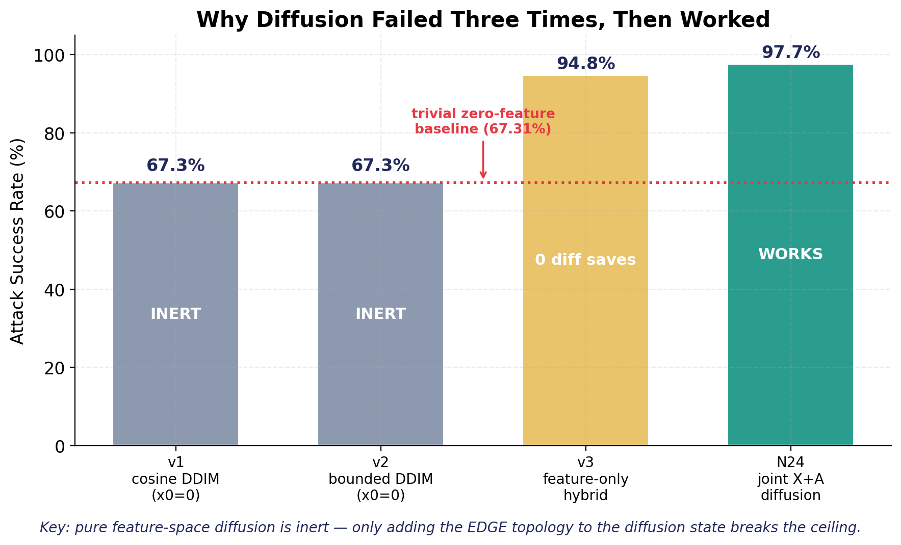
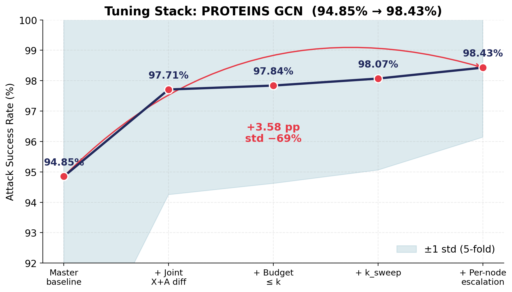
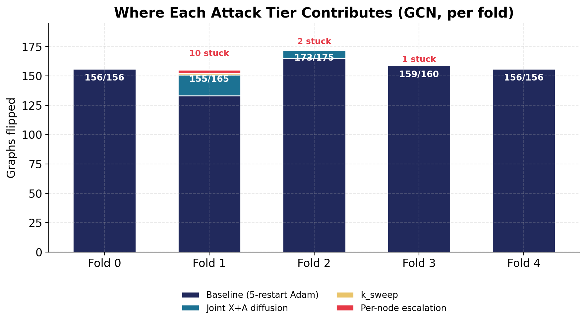
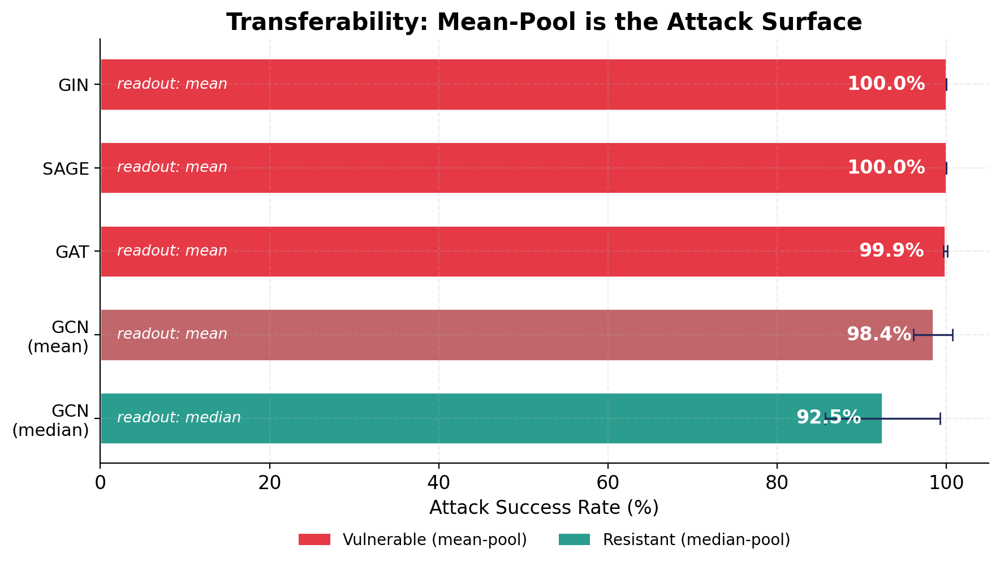
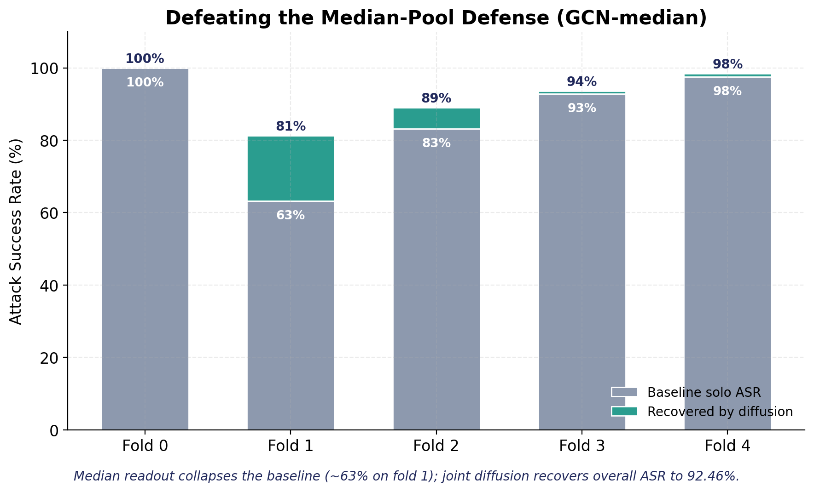

# Diffusion-Based Node Injection Attacks on Graph Classifiers
### Experiment Report — PROTEINS / GNN victims · 2026-05-20

---

## 1. Executive Summary

We developed **N24**, a discrete-time *joint* diffusion attack that injects adversarial
nodes (features **and** edges) into a graph to flip a GNN graph-classifier's prediction,
under a **black-box, query-only, injection-only** threat model.

| Metric | Result |
|--------|--------|
| **PROTEINS GCN ASR** | **98.43%** (from 94.85% baseline, **+3.58 pp**) |
| **Variance** | std 7.44% → **2.29%** (−69%) |
| **Transferability** | 100% on GIN / SAGE, 99.9% on GAT |
| **Vs. a real defense** | 92.46% on median-pool GCN |

The central scientific finding: **pure feature-space diffusion is inert** — it adds
nothing over a trivial zero-feature injection. Diffusion only becomes a useful attack
mechanism when **edge topology is part of the diffusion state**. Separately, the
**mean-pool readout — not the convolution type — is the true attack surface**.

---

## 2. Threat Model

- **Black-box / query-only:** the attacker observes model outputs (logits) but never
  gradients or weights. All gradients are zeroth-order (CGE) estimates from queries.
- **Injection-only:** the original graph `G` is never mutated. The attacker appends
  `m` new nodes with chosen features and edges. `construct_perturbed_graph` is pure.
- **Edge budget:** each injected node connects to at most `⌈2|E|/|N|⌉` (the per-graph
  average degree) original nodes — a stealth constraint, not full connectivity.

---

## 3. The Mechanism Journey (why diffusion failed, then worked)



| Variant | Diffusion state | ASR | Verdict |
|---------|-----------------|-----|---------|
| v1 — cosine DDIM | features only, `x₀ = 0` | 67.31% | **inert** (= trivial baseline) |
| v2 — bounded DDIM | features only, `x₀ = 0` | 67.31% | **inert** |
| v3 — feature-only hybrid | features, anchored at baseline | 94.85% | 0 diffusion saves |
| **N24 — joint X+A** | **features + edges** | **97.71%+** | **works** |

**Root cause of the early failures:** with `x₀ = 0` and a fixed full-connectivity
topology, the GCN's normalization absorbs all feature variation. The 5% of graphs the
baseline can't flip are **topology-immune** — no feature vector of any magnitude flips
them. Only by making the *edges* an optimization variable does the diffusion gain a
dimension that can actually change the prediction.

---

## 4. The Tuning Stack (PROTEINS GCN)



Each tier is a fallback that fires only when the previous one fails:

1. **Baseline** — 5-restart Adam generator + zeroth-order CGE gradients (94.85%).
2. **Joint X+A diffusion** — bounded DDIM on features + greedy edge search with
   cardinality = avg-degree (→ 97.71%).
3. **Budget ≤ k** — edge budget treated as an *upper bound*, keeping only positive-value
   edges (→ 97.84%).
4. **k_sweep** — retry stuck graphs with k ∈ {0.25k, 0.5k, 1.5k, 2k} (→ 98.07%).
5. **Per-node escalation** — `m=2` injected nodes with **independent** edge masks (→ 98.43%).

A 2-swap edge refinement was also added: same ASR but **35% faster** (better early edge
choices flip graphs in fewer steps).

---

## 5. Where Each Tier Contributes



The diffusion machinery activates **only on the hard graphs**. Folds 0 and 4 are fully
solved by the baseline alone; folds 1–2 are where joint diffusion, k_sweep, and per-node
escalation rescue 30 additional graphs the Adam baseline missed.

---

## 6. Robustness Sweep — what actually defends?



| Victim | Readout | ASR | Diffusion needed? |
|--------|---------|-----|-------------------|
| GIN | mean | 100.00% | no — baseline alone |
| SAGE | mean | 100.00% | no |
| GAT | mean | 99.88% | barely |
| GCN | mean | 98.43% | yes (rescues 24) |
| **GCN-median** | **median** | **92.46%** | **critical** |

**Changing the convolution is not a defense.** GIN (sum), GAT (attention), and SAGE
(sampling) all use mean-pool readout and are *more* vulnerable than GCN. The attack
surface is the **readout**, not the aggregator.

---

## 7. Defeating a Real Defense (median-pool)



Median-pool readout ignores the injected outlier node, collapsing the baseline-solo
attack to ~63% on the hardest fold. But the **joint X+A diffusion + k_sweep recovers the
overall ASR to 92.46%** — this is precisely the regime where the diffusion mechanism
earns its keep. Cost: attacking the defended model is ~40× slower than the undefended GNNs.

---

## 8. Negative Results (recorded for rigor)

| Lever | Outcome |
|-------|---------|
| T_steps 20→40, n_seeds 2→5 | identical ASR — algorithm-bound, not compute-bound |
| Force `node_budget=2` (shared edge mask) | **−1.85 pp** — duplicate hubs interfere; fixed by per-node masks |
| Feature-only diffusion (v1/v2/v3) | 0 contribution over baseline |

---

## 9. Takeaways

1. **Topology must be in the diffusion state.** Feature-only graph diffusion is inert.
2. **The readout is the attack surface.** Defend the pooling (median/trimmed-mean), not
   the convolution.
3. **The diffusion mechanism's value shows up against defenses** — on undefended models a
   simple baseline suffices; against median-pool it is the difference between 63% and 92%.

---

## 10. Reproduce

```bash
# Attack the canonical GCN (5-fold)
micromamba run -n graph_adversarial python run.py

# Train + attack the robustness zoo
micromamba run -n graph_adversarial python prepare_robust.py
micromamba run -n graph_adversarial python run_robust.py

# Regenerate figures
micromamba run -n graph_adversarial python report/report_charts.py
```

Key files: `attack.py` (N24 stack), `victims.py` (model zoo),
`prepare_robust.py` / `run_robust.py` (robustness eval).
